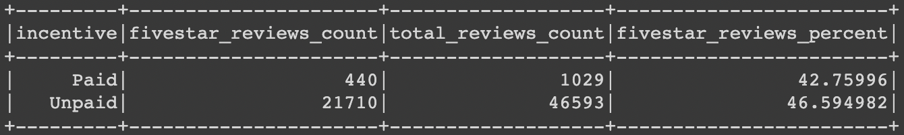

# 16-Amazon_Vine_Analysis-lukeperrin

## Overview

Online retail business has become an essential of the 21st century. Alongside the benefits of convenience and accessibility, there is also a cumbersome amount of consumer data. One way online businesses have worked to maximize their sales is through marketing their product by reviews. Some companies participate in *Vine programs*, which incentivize consumers to leave review by providing them payment or discounted products.

The online retail giant, Amazon, has implemented this strategy. Using PySpark, we will look at the Amazon customer reviews of electronics (provided by [this dataset](https://s3.amazonaws.com/amazon-reviews-pds/tsv/amazon_reviews_us_Electronics_v1_00.tsv.gz)). By wrangling the values in these data, we will assess what influence Vine programs have on the positiveness of reviews, if any at all.

## Results

The following table represents the counts acheived through extracting data from the source. (See [Vine_Review_Analysis.ipynb](Vine_Review_Analysis.ipynb)  for source code.)

#### How many Vine reviews and non-Vine reviews were there?

*There were `1029` Vine reviews (`incentive=Paid`) and `46593` non-Vine reviews (`incentive=Unpaid`) .*

#### How many Vine reviews were 5 stars? How many non-Vine reviews were 5 stars?

*There were `440` five-star Vine reviews (`incentive=Paid`) and `21710` five-star non-Vine reviews (`incentive=Unpaid`) .*

#### What percentage of Vine reviews were 5 stars? What percentage of non-Vine reviews were 5 stars?

*Of the `1029` Vine reviews, 42.8% were five-star reviews. Of the `46593` non-Vine reviews, 46.6% were five-star reviews.*

## Summary

The data indicate that there is no positivity bias presented by the Vine reviewers. In fact, the non-Vine reviewers provided proportionally more five-star reviews.

To extend this analysis, it would be interesting to see how these numbers change if we were to keep all reviews regardless of how many `helpful_votes` they received (in this dataframe, these were filtered to only include reviews with more than 20 `helpful_votes`, and then only those reviews that exceeded 50% `helpful_votes` over `total_votes`).

Additionally, it would be interesting to see if there are correlations against Vine program reviews, ratings, etc… against  `verified_purchase`. This would provide better veracity of those reviews.